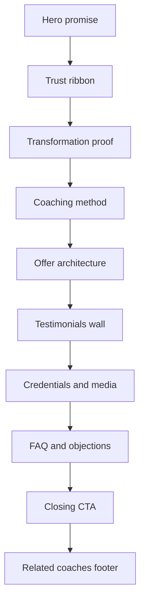

# Flagship Coach Detail Landing Plan

## Scope
- Primary target: [`frontend/src/pages/CoachDetailPage.tsx`](../frontend/src/pages/CoachDetailPage.tsx)
- Preserve current route, canonical SEO behavior, message flow, subscribe flow, and existing data endpoints
- Do **not** refactor [`frontend/src/pages/ProfilePublic.tsx`](../frontend/src/pages/ProfilePublic.tsx) or [`frontend/src/pages/ProfileCV.tsx`](../frontend/src/pages/ProfileCV.tsx) in this phase
- Prefer a frontend-first redesign using data already loaded by [`frontend/src/pages/CoachDetailPage.tsx`](../frontend/src/pages/CoachDetailPage.tsx)
- Treat backend/data-model additions as optional follow-up, not a blocker for flagship v1

## Goal
Turn the coach detail page into the app's core conversion surface: a page that feels like a premium landing page, establishes trust fast, showcases transformation proof, and drives users toward a single primary action.

## Scope lock for v1
- Redesign only [`frontend/src/pages/CoachDetailPage.tsx`](../frontend/src/pages/CoachDetailPage.tsx)
- Reuse only the data that page already loads unless a missing field is truly blocking the flagship story
- Do not expand backend scope unless a section cannot be expressed with current payloads
- Keep [`frontend/src/pages/ProfilePublic.tsx`](../frontend/src/pages/ProfilePublic.tsx) and [`frontend/src/pages/ProfileCV.tsx`](../frontend/src/pages/ProfileCV.tsx) visually untouched in this phase
- Treat this page as the canonical reference that later refactors will follow

## Product outcomes
1. A first-time visitor understands the coach's value in under 5 seconds
2. The page feels memorable, premium, and brand-defining rather than generic
3. The strongest CTA is obvious immediately
4. Proof is front-loaded so the user trusts before they compare prices
5. The page tells a story instead of listing data blocks

## Design thesis
### Direction
**Editorial athletic premium**

This page should feel closer to a high-end fitness campaign page or premium magazine feature than a dashboard profile. The tone should be sharp, confident, and aspirational.

### Experience promise
The first fold must answer four questions instantly:
1. Who is this coach for
2. What outcome does this coach help achieve
3. Why should I trust this person
4. What should I do next

### Visual principles
- Strong typography before decoration
- Large, intentional image moments
- Asymmetric composition with controlled whitespace
- One accent family only, used as emphasis rather than wallpaper
- Trust and proof placed before utility clutter
- Fewer containers, fewer borders, more hierarchy

### Anti-goals
- No endless stack of identical cards
- No safe black-gray-white SaaS template aesthetic
- No metric grid that looks copied from generic startup UI
- No technical UI copy in prominent areas such as SEO/permalink utility links
- No equal visual weight for every section

## Current page diagnosis
Current strengths in [`frontend/src/pages/CoachDetailPage.tsx`](../frontend/src/pages/CoachDetailPage.tsx):
- Already loads rich data: trainer, premium hero, programs, gyms, testimonials, before-after, media, press, similar coaches
- Already has working business actions: message, subscribe, payment status
- Already has canonical and OG metadata

Current weaknesses:
- Hero introduces identity, but does not sell desire or outcome
- Nearly every section uses the same card language, so nothing feels special
- Proof and offer sections appear as parallel blocks rather than a guided narrative
- Similar coaches compete too early with the primary conversion goal
- Utility elements dilute emotional focus at the top of the page

## Conversion hierarchy
### Primary action
- Message / start consultation

### Secondary action
- Explore programs / choose a package

### Supporting actions
- Review results
- Verify trust signals
- Explore gym presence

### Information priority
1. Who this coach helps
2. What outcome they deliver
3. Why to trust them
4. How the coaching works
5. Which offer to choose
6. What others achieved
7. How to start now

## Target flagship information architecture

## Target page structure

### 1. Hero promise block
**Purpose**
- Deliver immediate emotional hook and clarity
- Make the user feel this coach can solve a real goal

**Use existing data from**
- trainer name, avatar, specialties, base price, bio in [`frontend/src/pages/CoachDetailPage.tsx`](../frontend/src/pages/CoachDetailPage.tsx)
- `premium.hero.tagline`, `premium.hero.badges`, `premium.hero.metrics`

**Redesign requirements**
- Replace the current generic dark band with a full editorial hero composition
- Left side: headline, subheadline, role, trust markers, concise value proposition
- Right side: portrait or visual proof composition
- Put exactly one dominant CTA and one clearly secondary CTA
- Remove or visually demote utility links from the hero zone
- Introduce a trust strip immediately under the main copy, not as tiny chips floating in space

**Content model**
- Headline: outcome-oriented
- Subheadline: coach specialization + method + trust proof
- Microproof: verified, years experience, active gym, results count
- CTA pair: message and explore programs

### 2. Trust ribbon
**Purpose**
- Convert curiosity into baseline trust without making users read paragraphs

**Use existing data from**
- verified status
- pricing starting point
- gym links
- hero metrics/badges

**Redesign requirements**
- Horizontal trust band under hero
- Surface only the 4 to 6 strongest proofs
- Use mixed proof types rather than all number tiles
- Example proof items: verified, active at gyms, years experience, student results, featured media, price anchor

### 3. Transformation proof section
**Purpose**
- Show results before details

**Use existing data from**
- before-after photos
- testimonial snippets

**Redesign requirements**
- Pull before-after much higher in the page
- Make one lead transformation case large and editorial
- Support with 2 to 3 smaller proof items
- Pair visual proof with short captions such as duration, challenge, outcome
- This section should feel like evidence, not gallery browsing

### 4. Coaching method section
**Purpose**
- Explain why the coach is different
- Replace generic about text with a compelling framework

**Use existing data from**
- bio
- premium highlights
- specialties
- gym context if relevant

**Redesign requirements**
- Break long bio into 3 to 4 method pillars
- Turn highlights into a designed method grid or sequence
- Add a short narrative about coaching philosophy
- Avoid a plain paragraph dump

**Fallback rule**
- If premium highlights are missing, derive 3 method pillars from specialties, bio, and gym presence

### 5. Offer architecture section
**Purpose**
- Present programs as premium offers rather than neutral cards

**Use existing data from**
- programs list

**Redesign requirements**
- Stop treating all programs as equal cards
- Create a lead featured offer with strongest visual weight
- Secondary offers appear as supporting comparison options
- Clarify package differences faster: duration, cadence, intensity, availability, price framing
- Keep subscribe flow unchanged, only redesign presentation
- Add lightweight purchase reassurance near CTA

**Interaction notes**
- Preserve current subscribe button behavior
- Preserve payment confirmation modal logic, but redesign later in Code mode if needed

### 6. Testimonials wall
**Purpose**
- Turn social proof into emotional proof

**Use existing data from**
- testimonials

**Redesign requirements**
- Mix quote emphasis, result statements, and faces
- Break away from uniform card grid
- Give one or two testimonials hero treatment
- Use result achieved as a headline if available

### 7. Credentials and media section
**Purpose**
- Reinforce authority without interrupting conversion momentum earlier

**Use existing data from**
- press mentions
- media features
- gym links

**Redesign requirements**
- Merge press and featured media into one authority section
- Present as proof of reputation, not as another content gallery
- Gym affiliations can sit here or in the trust ribbon depending on strength

### 8. FAQ and objection handling
**Purpose**
- Remove friction before message or subscription

**Use existing data from**
- FAQ if available
- pricing logic and current offer details

**Redesign requirements**
- Answer the practical objections that stop conversion
- Suggested order: fit, schedule, online-offline format, beginner suitability, pricing expectation, how to start

### 9. Closing CTA
**Purpose**
- End the page with a decisive next step

**Redesign requirements**
- Large closing block with one clear CTA
- Repeat only the strongest promise and the simplest next step
- Do not end with similar coaches above the fold of this closing moment

### 10. Related coaches footer
**Purpose**
- Contain lateral exploration without cannibalizing conversion

**Use existing data from**
- similar coaches

**Redesign requirements**
- Move similar coaches to the very end
- Make the styling intentionally lighter than the main conversion path

## Narrative and copy system
### Copy principles
- Lead with outcomes, not biography
- Replace generic labels with high-intent language
- Keep section intros short, sharp, and directional
- Make every CTA sound like the next step of a coaching relationship, not a generic UI action

### Hero copy formula
- Eyebrow: coach type or niche
- Headline: transformation promise
- Supporting line: method plus trust proof
- CTA label: consultation-oriented primary action
- Secondary CTA label: package exploration

### Section voice
- Transformation proof should read like evidence
- Method section should read like a philosophy with structure
- Offers should read like premium service tiers
- FAQ should read like objection handling rather than documentation

## Component architecture for Code mode
Recommended extraction from [`frontend/src/pages/CoachDetailPage.tsx`](../frontend/src/pages/CoachDetailPage.tsx):
- `CoachFlagshipShell`
- `CoachHeroFlagship`
- `CoachTrustRibbon`
- `CoachResultsShowcase`
- `CoachMethodSection`
- `CoachOffersFlagship`
- `CoachTestimonialsWall`
- `CoachAuthoritySection`
- `CoachFaqSection`
- `CoachClosingCta`
- `CoachRelatedFooter`

## Mapping from current sections to flagship sections
| Current source | New destination | Note |
| --- | --- | --- |
| hero summary | hero promise + trust ribbon | split utility from persuasion |
| premium hero badges and metrics | trust ribbon + hero proof | not a boxed metric grid |
| bio + highlights | coaching method | narrative first |
| before-after | transformation proof | move upward |
| programs | offer architecture | feature one recommended offer |
| testimonials | testimonials wall | emphasize outcomes |
| media + press | credentials and media | merge as authority layer |
| similar coaches | related footer | de-emphasize |

## Visual system specification
### Color
- Base: warm-tinted light neutrals or rich near-black neutrals, not pure black and white
- Accent: one premium athletic accent such as muted copper, clay red, or oxidized brass
- Use accent only for the primary CTA, key proof markers, and selected dividers

### Typography
- Choose a more distinctive display voice for hero and section intros
- Keep body text highly readable and calmer
- Reduce all-caps utility labels; use them only for small proof markers
- Increase contrast between hero headline, section headings, and metadata

### Layout rhythm
- Alternate dense sections with breathing space
- Use 1 to 2 full-bleed moments to avoid container fatigue
- Keep asymmetric alignment in hero and proof sections
- Do not box every content block

### Imagery
- The portrait must feel premium, not merely uploaded
- Before-after must feel curated, not dumped in a symmetric grid
- Media section should look selected by an editor, not listed by a CMS

### Motion
- Use reveal motion only where it supports reading sequence
- Prioritize section entrances, CTA emphasis, and image transitions
- Avoid decorative bounce or excessive hover animation

## Responsive strategy
### Mobile
- Hero becomes stacked but still emotional
- Sticky bottom CTA bar for message and view programs
- Trust ribbon becomes horizontally scrollable chips or compact proof rail
- Transformation proof becomes swipeable or one hero case + one stacked summary
- Pricing becomes one featured offer first, then compact comparison cards

### Desktop
- Hero may use asymmetric two-column composition
- Sticky secondary nav allowed only if it improves long-form reading
- Sticky CTA rail is optional but must never crowd the hero

## States and fallbacks
### Loading
- Replace generic block skeletons with section-aware skeletons
- Hero skeleton should preview the flagship composition

### Missing premium content
- Derive method and trust sections from base trainer data when premium payload is sparse
- Hide weak sections rather than rendering empty framed boxes

### Empty offers
- Show consult-first CTA instead of dead empty programs area

### Error / unavailable content
- Keep business CTA available whenever trainer identity loads successfully

## SEO and business safety constraints
- Preserve title, description, canonical, OG behavior in [`frontend/src/pages/CoachDetailPage.tsx`](../frontend/src/pages/CoachDetailPage.tsx)
- Preserve route compatibility for ID and slug entry points
- Preserve current message navigation and subscribe flow
- Do not block checkout or payment-status actions behind design-only dependencies
- Defer any major payload/schema change until after frontend flagship v1 proves itself

## Performance constraints
- Lazy-load non-critical image-heavy sections
- Avoid shipping huge hero media by default
- Prevent layout shift around hero and transformation images
- Keep hydration simple; prefer composition and CSS over complex client-only effects

## Implementation slices
### Slice 1
- Extract a page-level view model from the existing fetches
- Strip utility clutter from the current top bar and hero
- Build the new hero, trust ribbon, and mobile sticky CTA behavior

### Slice 2
- Reorder the page so proof appears before deeper explanation
- Implement transformation proof and coaching method sections
- Derive fallback content when premium blocks are missing

### Slice 3
- Rebuild programs into a featured-offer architecture
- Rebuild testimonials and authority sections
- Push similar coaches to a lightweight footer treatment

### Slice 4
- Add closing CTA, refine copy hierarchy, refine motion, and polish responsive spacing
- QA SEO, subscription flow, message flow, and payment-status flow

## Execution phases
### Phase 1
- Audit current data availability and define fallback view model
- Remove top-level utility clutter from the persuasion path
- Rebuild hero and trust ribbon

### Phase 2
- Reorder page around proof first and offers second
- Redesign transformation proof and method sections
- Build flagship offer architecture around programs

### Phase 3
- Rebuild testimonials and authority sections
- Move similar coaches to lightweight footer
- Add closing CTA and mobile sticky action treatment

### Phase 4
- Refine loading states, empty states, copy hierarchy, spacing rhythm, and motion
- QA SEO, subscription flow, message flow, and responsive behavior

## Code-mode checklist
- Extract a page-level view model from current fetched payloads
- Implement new flagship shell without breaking current data fetching
- Build hero and trust ribbon first before secondary sections
- Move before-after and testimonials above lower-priority content
- Convert program cards into a featured-offer system
- Add final closing CTA and mobile sticky actions
- Run responsive QA on compact mobile, tablet, desktop, and wide desktop

## Acceptance criteria
- The page communicates coach value before the user scrolls
- Primary CTA is obvious in under 2 seconds
- The first fold answers audience, outcome, trust, and next step
- Proof appears before deep detail
- Programs feel like offers, not rows in a marketplace grid
- Similar coaches no longer steal attention early
- The page feels brand-defining enough to become the reference layout for later profile pages

## Out of scope for v1
- Refactoring [`frontend/src/pages/ProfilePublic.tsx`](../frontend/src/pages/ProfilePublic.tsx)
- Refactoring [`frontend/src/pages/ProfileCV.tsx`](../frontend/src/pages/ProfileCV.tsx)
- Deep backend schema expansion unless current payloads block the flagship narrative
- New payment mechanics or messaging flow changes

## Follow-on phase after v1
Once [`frontend/src/pages/CoachDetailPage.tsx`](../frontend/src/pages/CoachDetailPage.tsx) reaches flagship quality, reuse the same narrative and visual system for [`frontend/src/pages/ProfilePublic.tsx`](../frontend/src/pages/ProfilePublic.tsx) and [`frontend/src/pages/ProfileCV.tsx`](../frontend/src/pages/ProfileCV.tsx) instead of letting those pages continue to evolve independently.
