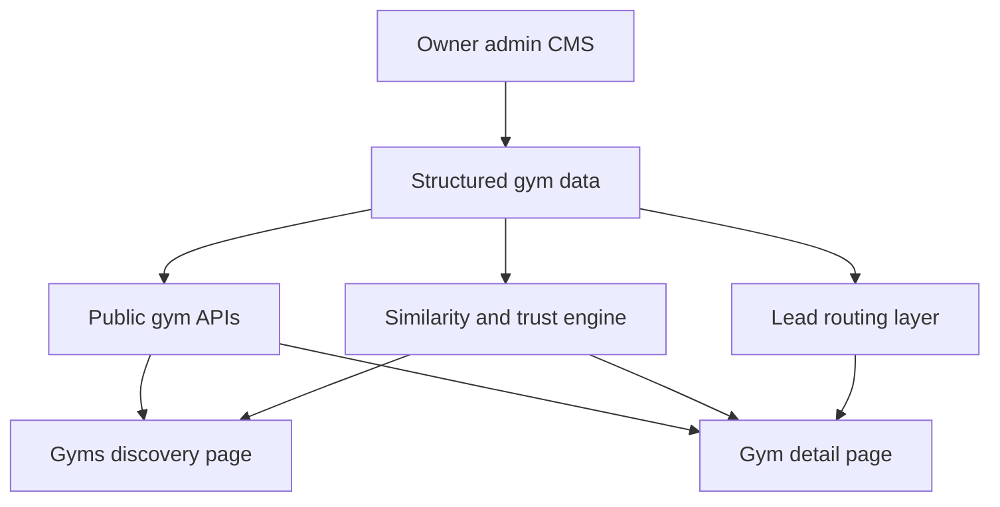

# Gym Marketplace Full Roadmap

## 1. Objective
Build a premium active-space marketplace for gym, fitness, yoga, pilates, boutique studio, and recovery venues.

The new system should make three things obvious within seconds:
- what kind of venue this is
- who it is best for
- what the fastest next action should be

## 2. Approved scope
This roadmap is approved for full P0 + P1 rollout.

### P0
- expand gym marketplace data model for discovery and decision-making
- expand owner and admin content management flows
- expand public APIs and frontend DTOs
- redesign listing page
- redesign card system
- redesign gym detail page with sticky conversion rail
- backfill pilot venue content
- QA for responsive, accessibility, performance, SEO, and fallbacks

### P1
- schedule-aware discovery
- room and zone storytelling
- vertical-specific attributes for yoga, pilates, boutique studio, and recovery spaces
- similar venue logic
- trust and review dimension blocks

## 3. Design direction
### Purpose
Help users discover and evaluate active spaces quickly, then convert into inquiry, trial, or visit.

### Tone
Editorial marketplace:
- bright and breathable
- thumbnail-first
- premium but practical
- image-led rather than dashboard-like

### What should feel memorable
Two things should stand out:
- listing cards that sell the venue through space, not just text
- a gym detail page where the sticky right rail makes the next step obvious

## 4. Current baseline
Current implementation already provides a usable foundation:
- gym center identity
- branch operations data
- pricing, amenities, equipment, gallery, trainers, and reviews

What is missing is structured data for:
- taxonomy and vertical classification
- room and zone storytelling
- schedule and program intelligence
- pricing semantics
- trust dimensions
- lead routing

## 5. Target information architecture

### Listing page must answer
- what is this venue
- where is it
- what does it cost to get started
- who is it for
- why should I click it instead of the next venue

### Detail page must answer
- is this venue suitable for my training style
- which branch should I choose
- what spaces, classes, and services really exist here
- what package or entry point should I choose
- how do I contact or visit now

## 6. Data model strategy
Use a hybrid model:
- normalized taxonomy for filtering and recommendation
- structured branch content for decision-making
- conversion routing for CTA behavior
- lightweight denormalized summary fields for fast listing performance

## 7. Schema plan

### 7.1 Normalize venue taxonomy
Create a reusable taxonomy system.

#### New table: gym_taxonomy_terms
Fields:
- id
- slug
- label
- term_type
- parent_id nullable
- sort_order
- is_active

Suggested term types:
- venue_type
- training_style
- audience
- positioning
- service_model
- recovery_type
- atmosphere

#### New table: gym_center_taxonomy_terms
Fields:
- id
- gym_center_id
- term_id
- is_primary
- sort_order

Use this layer for:
- gym
- fitness club
- yoga studio
- pilates studio
- boutique studio
- recovery venue
- beginner-friendly
- women-focused
- athlete-focused
- premium
- hardcore
- luxury
- community-driven

### 7.2 Extend center-level discovery profile
Extend existing gym center data with marketplace summary fields.

#### Extend gym_centers
Add:
- primary_venue_type_slug
- price_from_amount
- price_from_billing_cycle
- positioning_tier
- beginner_friendly
- women_friendly
- family_friendly
- athlete_friendly
- recovery_focused
- discovery_blurb
- hero_value_props jsonb
- profile_completeness_score
- response_sla_text
- default_primary_cta
- default_secondary_cta
- featured_weight

### 7.3 Extend branch-level decision data
#### Extend gym_branches
Add:
- neighborhood_label
- parking_summary
- locker_summary
- shower_summary
- towel_service_summary
- crowd_level_summary
- best_visit_time_summary
- accessibility_summary
- women_only_summary
- child_friendly_summary
- check_in_instructions
- branch_tagline
- whatsapp_number
- messenger_url
- consultation_phone
- cover_media_id nullable
- branch_status_badges jsonb

### 7.4 Add room and zone storytelling
#### New table: gym_zones
Fields:
- id
- branch_id
- zone_type
- name
- description
- capacity nullable
- area_sqm nullable
- booking_required boolean
- temperature_mode nullable
- sound_profile nullable
- natural_light_score nullable
- is_signature_zone boolean
- sort_order
- is_active

Supported zone types:
- cardio_floor
- strength_floor
- free_weight_zone
- functional_zone
- yoga_room
- pilates_reformer_room
- pilates_mat_room
- cycling_room
- boxing_zone
- dance_room
- recovery_zone
- locker_zone
- pool_zone
- sauna_zone
- outdoor_zone
- other

### 7.5 Add structured media semantics
#### Extend gym_gallery
Add:
- media_role
- zone_id nullable
- alt_text nullable
- is_hero boolean
- is_listing_thumb boolean
- is_featured boolean
- orientation nullable

Suggested media roles:
- hero
- exterior
- reception
- open_gym
- class_in_action
- trainer_in_action
- equipment_detail
- zone_overview
- amenity
- recovery
- community
- before_after
- other

### 7.6 Add pricing semantics
#### Extend gym_pricing
Add:
- plan_type
- access_scope
- included_services jsonb
- class_credits nullable
- session_count nullable
- trial_available boolean
- trial_price nullable
- joining_fee nullable
- deposit_amount nullable
- freeze_policy_summary nullable
- cancellation_policy_summary nullable
- validity_days nullable
- peak_access_rule nullable
- supports_multi_branch boolean
- highlighted_reason nullable

Plan types:
- membership
- class_pack
- private_pt
- drop_in
- trial
- reformer_pack
- recovery_pack
- corporate

Access scope values:
- single_branch
- all_branches
- selected_branches

### 7.7 Add schedule intelligence
#### New table: gym_programs
Fields:
- id
- branch_id
- zone_id nullable
- trainer_id nullable
- title
- program_type
- level
- description
- duration_minutes
- capacity
- language_code nullable
- equipment_required jsonb nullable
- booking_mode
- is_active

#### New table: gym_program_sessions
Fields:
- id
- program_id
- starts_at
- ends_at
- seats_total
- seats_remaining
- waitlist_enabled
- is_cancelled
- session_note nullable

### 7.8 Add branch-specific trainer context
#### Extend gym_trainer_links
Add:
- specialization_summary
- featured_at_branch boolean
- accepts_private_clients boolean
- branch_intro nullable
- languages jsonb nullable
- visible_order

#### Optional table: gym_trainer_availability
Fields:
- id
- trainer_link_id
- day_key
- start_time
- end_time
- availability_type

### 7.9 Add trust dimensions to reviews
#### Extend gym_reviews
Add:
- equipment_rating nullable
- cleanliness_rating nullable
- coaching_rating nullable
- atmosphere_rating nullable
- value_rating nullable
- crowd_rating nullable
- visit_type nullable
- is_verified_visit boolean

Also expose branch and chain aggregates for these dimensions.

### 7.10 Add lead-routing logic
#### New table: gym_lead_routes
Fields:
- id
- branch_id
- inquiry_type
- primary_channel
- fallback_channel
- phone nullable
- whatsapp nullable
- messenger_url nullable
- email nullable
- owner_user_id nullable
- active_hours jsonb nullable
- auto_prefill_message nullable
- is_active

Inquiry types:
- consultation
- visit_booking
- class_trial
- membership
- private_training
- corporate

## 8. API and DTO roadmap

### Listing APIs must return
- primary venue type
- audience and style tags
- listing thumbnail
- city and neighborhood summary
- price_from summary
- top trust proof
- key badges
- featured weight

### Detail APIs must return
- branch chooser data
- hero media and gallery rail metadata
- structured zone blocks
- pricing cards with included services
- lead route metadata
- review dimension summary
- trainer context
- similar venues payload
- schedule blocks when available

### Similar venue logic should match on
- venue type
- price band
- city or district
- audience tags
- service model
- trust floor

## 9. CMS roadmap

### Owner-facing CMS
Add structured editing for:
- taxonomy selection
- branch decision summaries
- media labeling and gallery ordering
- room and zone manager
- pricing semantics and policies
- class schedules and sessions
- trainer context
- lead-routing settings

### Admin-facing CMS
Add moderation and curation for:
- taxonomy terms
- featured venues
- profile completeness and quality score
- media role validation
- pilot backfill overrides
- route validation

## 10. Frontend system plan

### Global CSS system
Expand the global layer with three new surface systems:
- discovery shell
- marketplace card language
- detail marketplace shell

Add reusable tokens for:
- marketplace spacing rhythm
- thumbnail ratios
- badge styles
- sticky rail spacing
- premium light surfaces with tinted neutrals
- structured empty states

### Listing redesign
New structure:
1. editorial hero
2. discovery filter bar
3. featured venue rail
4. category and need-based rails
5. main results grid
6. guided empty state

### GymCard redesign
Each card should prioritize:
1. intentional image
2. badge row
3. venue title and short positioning line
4. location and starting price
5. proof row with trust or scale
6. hover affordance or secondary action

Card variants:
- featured card
- standard card
- compact carousel card

### Detail redesign
Structure:
1. editorial summary strip
2. large hero gallery with thumbnail rail
3. sticky section navigation
4. two-column marketplace body
5. sticky conversion rail
6. similar venues and map near the bottom

Left column sections:
- overview
- signature zones
- amenities and equipment
- trainers and specialists
- pricing and passes
- class schedules
- trust and reviews
- similar venues
- map and branch context

Right rail sections:
- branch selector
- price_from summary
- primary and secondary CTA
- fast contact channels
- open status and best visit time
- policy and trust notes

## 11. Vertical-specific content rules

### Gym and fitness clubs
Show:
- equipment scale
- free-weight and machine proof
- crowd summary
- branch scale and pricing entry point

### Yoga studios
Show:
- style taxonomy
- teacher-led schedule
- ambience and heat mode
- props availability
- beginner path

### Pilates studios
Show:
- reformer count
- private, duet, and group formats
- instructor specialization
- rehab-friendly notes where applicable

### Boutique studios
Show:
- room capacity
- session format
- booking and waitlist clarity
- class rhythm and vibe

### Recovery and wellness venues
Show:
- treatment and recovery types
- zone-specific proof
- consultation-oriented CTA flow

## 12. Migration and backfill plan

### Backfill rules
- infer venue type from current name, description, tagline, and highlights
- derive price_from from lowest valid branch pricing
- promote first valid hero-capable image when no explicit hero exists
- map existing image_type to new media_role defaults
- default existing pricing rows to membership and single_branch until edited
- keep review dimensions nullable instead of inventing values
- keep branch decision summaries nullable until owner input exists

### Safety rules
- no destructive rewrite of existing gym data
- every new field must have safe null or fallback handling
- public APIs must preserve backward compatibility during transition

## 13. Pilot rollout plan
Create a deliberately mixed pilot cohort:
- 2 mainstream gyms
- 1 premium fitness club
- 1 yoga studio
- 1 pilates reformer studio
- 1 boutique studio
- 1 recovery or wellness venue

For each pilot venue complete:
- taxonomy
- hero and gallery semantics
- branch decision content
- pricing semantics
- zones
- trainer context
- lead-routing setup
- trust summaries where data exists

## 14. QA gates
Before rollout, validate:
- mobile and desktop behavior
- accessibility and keyboard navigation
- image fallback states
- pricing fallback states
- schedule fallback states
- SEO metadata and schema coverage
- performance of listing grid and detail gallery
- analytics events for CTA usage, filter usage, and similar venue clicks

## 15. Execution order
1. extend schema and entities
2. add migrations and backfill logic
3. expand CMS
4. expand public APIs and DTOs
5. build global CSS marketplace system
6. redesign listing and cards
7. redesign detail page and sticky conversion rail
8. seed pilot data
9. QA and refine

## 16. Mermaid overview

## 17. Implementation checklist
- Create migrations for taxonomy, zones, schedules, pricing semantics, trust metrics, and lead routing
- Extend TypeORM entities, services, and controllers for the new gym marketplace model
- Add owner and admin CMS support for structured venue content
- Expand public APIs for listing, detail, schedule, and similar venues
- Add global CSS marketplace primitives and utility classes
- Redesign listing page and card system
- Redesign gym detail conversion experience
- Seed and validate pilot venues across all approved verticals
- Run QA across responsive, accessibility, SEO, fallback, and analytics gates
