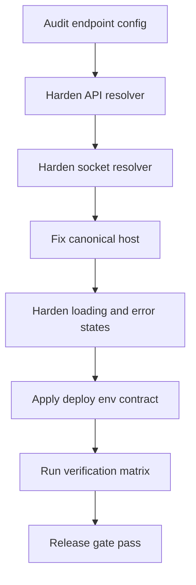

# Kế hoạch chi tiết xử lý lỗi loading toàn hệ thống online

## 1. Crux và phạm vi sửa

Crux của sự cố là cấu hình endpoint frontend không an toàn cho production: frontend đang có fallback localhost trong tầng API và socket, cộng với canonical SEO hardcode localhost. Khi deploy online, client gọi về localhost của chính người dùng nên request thất bại, dẫn đến trạng thái loading kéo dài.

Phạm vi của kế hoạch này tập trung vào frontend hardening và contract triển khai:

- Endpoint resolution cho API và Socket
- Canonical URL generation cho các trang detail
- Error-state hardening để không treo loading vô hạn
- Build and deploy contract cho Vite env
- Verification matrix cho các route đang bị ảnh hưởng

---

## 2. Mục tiêu chất lượng

1. Không còn request nào trỏ localhost trong môi trường online.
2. Không còn loading vô hạn khi API lỗi hoặc timeout.
3. Socket kết nối đúng host production và có fallback behavior rõ ràng.
4. Canonical và og:url không chứa localhost.
5. Có checklist triển khai và rollback rõ ràng, có thể giao cho bất kỳ dev nào thực thi độc lập.

---

## 3. Wave triển khai chi tiết

## Wave A - Endpoint resolution hardening

### A1. Chuẩn hóa API base URL

**Tệp ảnh hưởng:**
- `frontend/src/services/api.ts`

**Việc cần làm:**
- Bỏ fallback localhost cứng trong production flow.
- Thiết kế resolver theo thứ tự ưu tiên:
  1) `import.meta.env.VITE_API_URL`
  2) same-origin API fallback an toàn trong production
  3) localhost chỉ cho dev local có chủ đích
- Chuẩn hóa hậu xử lý URL:
  - bỏ dấu slash cuối
  - đảm bảo suffix `/api/v1`

**Tiêu chí nghiệm thu:**
- Build production không sinh `http://localhost:3001` trong bundle runtime path của API client.
- `apiClient.baseURL` luôn hợp lệ và nhất quán.

### A2. Chuẩn hóa Socket endpoint

**Tệp ảnh hưởng:**
- `frontend/src/services/socketService.ts`

**Việc cần làm:**
- Dùng chung nguyên tắc resolver với API URL để suy ra socket host.
- Loại bỏ fallback localhost cho production.
- Đảm bảo strip `/api/v1` chính xác trước khi truyền cho `io`.
- Ghi log lỗi socket theo hướng actionable, tránh log mơ hồ.

**Tiêu chí nghiệm thu:**
- `socketService.connect` luôn dùng host production khi deploy online.
- Khi socket fail, UI không treo và có thể recover qua reconnect flow.

---

## Wave B - SEO canonical host hardening

### B1. Loại bỏ localhost trong canonical và og:url

**Tệp ảnh hưởng:**
- `frontend/src/pages/CoachDetailPage.tsx`
- `frontend/src/pages/ProfilePublic.tsx`
- `frontend/src/pages/AthleteDetailPage.tsx`

**Việc cần làm:**
- Bỏ hardcode `http://localhost:5173`.
- Dùng cơ chế build-time domain config hoặc runtime-origin-safe helper thống nhất.
- Đảm bảo route canonical vẫn đúng logic coach và athlete.

**Tiêu chí nghiệm thu:**
- HTML head của các trang detail chỉ xuất domain production hợp lệ.
- Không còn localhost trong canonical và og:url ở mọi môi trường online.

---

## Wave C - Runtime state hardening chống loading vô hạn

### C1. Chuẩn hóa error-state trong trang bị ảnh hưởng trực tiếp

**Tệp ảnh hưởng ưu tiên cao:**
- `frontend/src/pages/MessagesPage.tsx`
- `frontend/src/pages/ProgramsPage.tsx`
- `frontend/src/pages/Coaches.tsx`

**Việc cần làm:**
- Mọi luồng fetch phải có kết thúc loading rõ ràng trong cả success và failure path.
- Bổ sung state lỗi hiển thị cho người dùng và CTA retry.
- Phân tách rõ empty-state và error-state để tránh hiểu nhầm là loading.
- Bảo đảm request fail không chặn UI chính vô thời hạn.

**Tiêu chí nghiệm thu:**
- Mất kết nối mạng hoặc 5xx vẫn thoát loading, hiển thị lỗi và retry action.
- Không route nào trong danh sách ưu tiên bị spinner vô hạn.

### C2. Hardening cho auth refresh failure

**Tệp ảnh hưởng:**
- `frontend/src/services/api.ts`

**Việc cần làm:**
- Đảm bảo refresh-token failure không gây vòng lặp retry ngầm.
- Khi 401 không recover được, redirect login theo một đường rõ ràng và dứt điểm.

**Tiêu chí nghiệm thu:**
- Không có network waterfall lặp refresh không kiểm soát.
- Trạng thái auth thất bại cho UX nhất quán trên mọi route private.

---

## Wave D - Deployment contract cho Vite env

### D1. Thiết lập contract biến môi trường bắt buộc

**Tệp và điểm cập nhật:**
- `frontend/.env.example`
- tài liệu triển khai trong `RUNBOOK.md` hoặc file plan deploy mới

**Việc cần làm:**
- Định nghĩa rõ `VITE_API_URL` bắt buộc cho staging và production.
- Nêu đúng format ví dụ: `https://api.domain/api/v1`.
- Ghi rõ Vite inject env ở build-time, không phải runtime.

**Tiêu chí nghiệm thu:**
- Deploy pipeline có bước verify biến môi trường trước build.
- Không có release production thiếu `VITE_API_URL`.

### D2. Guardrail trước release

**Việc cần làm:**
- Bổ sung checklist pre-release:
  - grep artifact hoặc source build để phát hiện localhost
  - xác nhận API host và socket host
  - smoke test route trọng yếu

**Tiêu chí nghiệm thu:**
- Gate fail nếu còn localhost trong artifact production.

---

## Wave E - Verification matrix sau sửa

## E1. Matrix chức năng bắt buộc

1. Route `/messages`
   - load conversations thành công
   - load message thread thành công
   - gửi tin nhắn không treo UI
2. Route `/programs`
   - load danh sách programs
   - create update publish không treo loading
3. Route `/coaches`
   - list trainers render ổn định
   - click vào coach và athlete đi đúng canonical route
4. Route detail
   - `/coach/:slug`
   - `/athletes/:slug`
   - `/gyms/:slug`
   - canonical và og:url đúng domain production

## E2. Matrix lỗi chủ động

- Chặn mạng hoàn toàn
- Trả về 401
- Trả về 500
- Timeout giả lập

Với mọi case trên, UI phải:
- thoát loading
- hiển thị trạng thái lỗi rõ ràng
- có hành động retry hoặc điều hướng hợp lý

---

## 4. Mermeid flow triển khai an toàn

---

## 5. Danh sách công việc thực thi cho Code mode

- Refactor resolver trong `frontend/src/services/api.ts`
- Refactor resolver trong `frontend/src/services/socketService.ts`
- Chuẩn hóa canonical URL trong:
  - `frontend/src/pages/CoachDetailPage.tsx`
  - `frontend/src/pages/ProfilePublic.tsx`
  - `frontend/src/pages/AthleteDetailPage.tsx`
- Bổ sung error-state và retry UX cho:
  - `frontend/src/pages/MessagesPage.tsx`
  - `frontend/src/pages/ProgramsPage.tsx`
  - ưu tiên kiểm tra thêm `frontend/src/pages/Coaches.tsx`
- Cập nhật contract env trong:
  - `frontend/.env.example`
  - `RUNBOOK.md`
- Chạy build và smoke verification trước khi chốt release

---

## 6. Checklist nghiệm thu cuối cùng

- Không còn localhost trong API socket canonical ở bản production
- Không còn spinner vô hạn trên các route trọng điểm
- Error message rõ ràng, có retry path
- Env deploy được định nghĩa bắt buộc và kiểm tra trước build
- Smoke test manual qua online environment đạt toàn bộ case bắt buộc
