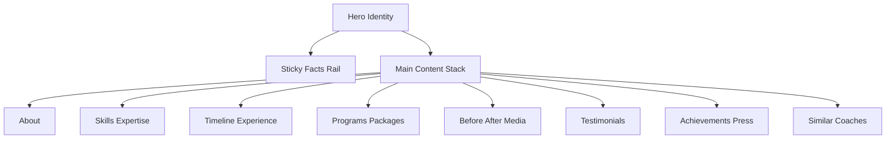

# Premium Coach Profile Plan

## Goal
Nâng cấp bố cục trang profile detail theo phong cách premium tham chiếu từ trang mẫu, đồng thời mở rộng dữ liệu để hiển thị phong phú hơn, giữ tương thích API cũ để không làm hỏng các màn hiện tại.

## Scope hiện tại
- Frontend chính: `frontend/src/pages/CoachDetailPage.tsx`
- Frontend liên quan: `frontend/src/pages/ProfilePublic.tsx`
- Backend profile: `backend/src/routes/profile.ts`, `backend/src/controllers/profileController.ts`, `backend/src/services/profileService.ts`
- Entities đang có nền tảng tốt: `backend/src/entities/TrainerProfile.ts`, `backend/src/entities/TrainerExperience.ts`, `backend/src/entities/TrainerSkill.ts`, `backend/src/entities/TrainerPackage.ts`

## Gap phân tích nhanh so với style premium
1. Hero hiện tại còn đơn giản, thiếu lớp nhận diện cá nhân mạnh như tagline, trust badges, metrics nổi bật.
2. Cột trái chưa đủ chiều sâu về thông tin niềm tin: chứng chỉ, ngôn ngữ, availability, links social có cấu trúc hiển thị cao cấp.
3. Cột phải chưa có narrative flow rõ ràng: story, timeline, highlights, media showcase, proof block.
4. Dữ liệu backend có sẵn một phần, nhưng thiếu các khối riêng cho press/awards trọng tâm, featured media, CTA cấu hình theo profile.
5. Chưa có model kiểm soát thứ tự section giúp tùy biến bố cục mà vẫn giữ an toàn API cũ.

## Đề xuất Information Architecture cho profile premium

### Desktop structure
- Hero full-width
  - Avatar, full name, headline, short bio
  - Trust chips: verified, years exp, clients trained
  - Primary CTA: Message
  - Secondary CTA: Subscribe program / View packages
- Main grid
  - Left sticky rail
    - Quick facts
    - Certifications top
    - Languages
    - Social links
    - Contact / location / timezone
  - Right content stack
    - About long-form
    - Expertise and skills
    - Career timeline
    - Signature programs/packages
    - Before/After showcase
    - Testimonials
    - Achievements/Press mentions
    - Similar coaches

### Mobile structure
- Hero compact
- CTAs fixed at bottom edge (Message + Subscribe)
- Sections theo thứ tự ưu tiên: About -> Programs -> Proof blocks -> Similar coaches

## Đề xuất mở rộng Database tối thiểu nhưng đủ premium

### 1. Mở rộng bảng `trainer_profiles`
Giữ bảng hiện tại làm trục chính và bổ sung cột không phá vỡ tương thích:
- `profile_tagline` varchar
- `profile_theme_variant` varchar
- `hero_badges` jsonb
- `key_metrics` jsonb
- `cta_config` jsonb
- `section_order` jsonb
- `is_featured_profile` boolean

Lý do: nhanh triển khai, không tăng số join cho các block nhỏ, dễ fallback.

### 2. Thêm bảng `trainer_profile_highlights`
Mục đích: lưu các điểm nổi bật có icon/label/value để render card premium.
- id
- trainer_id
- title
- value
- icon_key
- order_number
- is_active

### 3. Thêm bảng `trainer_media_features`
Mục đích: quản lý media showcase hero/content.
- id
- trainer_id
- media_type image hoặc video
- url
- thumbnail_url
- caption
- order_number
- is_featured
- is_active

### 4. Thêm bảng `trainer_press_mentions`
Mục đích: trust social proof từ báo chí/sự kiện.
- id
- trainer_id
- source_name
- title
- mention_url
- published_at
- logo_url
- excerpt
- order_number

### 5. Tận dụng bảng đã có
- `trainer_experience` dùng cho timeline
- `trainer_skills` dùng cho expertise
- `trainer_packages` cho premium package cards
- `testimonials` và `before_after` endpoint hiện hữu tiếp tục dùng

## Kế hoạch migration và tương thích ngược
1. Tạo migration mới cho cột thêm vào `trainer_profiles` và 3 bảng mới.
2. Tất cả cột mới đều nullable hoặc default an toàn.
3. Không thay đổi response field hiện có của API cũ.
4. Bổ sung response field mới dưới nhánh `premium` để frontend mới tiêu thụ.
5. Nếu dữ liệu premium chưa có, backend trả mảng rỗng hoặc null-safe object.

## Kế hoạch API

### Giữ nguyên endpoint cũ
- Không thay đổi contract bắt buộc trên endpoint hiện tại để tránh regressions.

### Mở rộng payload profile detail
Trong service `profileService`, thêm aggregate data mới:
- `premium.hero`
- `premium.highlights`
- `premium.mediaFeatures`
- `premium.pressMentions`
- `premium.sectionOrder`

### Quy tắc fallback
- Nếu thiếu `premium.hero`, fallback về field hiện có như `full_name`, `bio`, `specialties`, `base_price_monthly`.
- Nếu thiếu dữ liệu block mới, section tương ứng ẩn.

## Kế hoạch triển khai frontend

### Component decomposition
- `CoachPremiumHero`
- `CoachFactsRail`
- `CoachAboutSection`
- `CoachExperienceTimeline`
- `CoachMediaShowcase`
- `CoachPressMentions`
- `CoachProgramsPremium`
- `CoachProofSection`

Áp dụng trước trên `CoachDetailPage`, sau đó đồng bộ sang `ProfilePublic` để tránh diff quá lớn một lần.

### Rendering strategy
- Page shell giữ nguyên route và SEO canonical hiện tại.
- Inject section mới theo `premium.sectionOrder` nếu có.
- Preserve business actions: message, subscribe, package links.
- Skeleton/loading riêng cho hero và sections để cảm giác premium ổn định.

## Test and validation checklist
1. Visual parity
- Hero và nhịp bố cục đạt cảm giác premium rõ rệt.
- Left sticky rail hoạt động đúng desktop.
- Mobile không vỡ layout.

2. Data integrity
- Profile có dữ liệu mới hiển thị đủ block.
- Profile chưa có dữ liệu mới vẫn hiển thị tốt bằng fallback.

3. API compatibility
- Màn cũ không dùng premium payload vẫn chạy bình thường.
- Không đổi key bắt buộc trong response cũ.

4. Business flow safety
- Message flow vẫn điều hướng đúng.
- Subscribe flow vẫn tạo pending payment và check status đúng.

5. SEO
- Canonical, title, description, OG vẫn đúng với slug route.

## Execution breakdown cho Code mode
1. Tạo migration và entities mới.
2. Mở rộng service/controller profile trả thêm khối `premium`.
3. Refactor `CoachDetailPage` theo component premium.
4. Đồng bộ `ProfilePublic` theo cùng design language.
5. QA regression các luồng message/subscribe/seo.

## Risk control
- Không thay đổi architecture hiện có.
- Không đụng các thư mục restricted.
- Chỉ mở rộng theo hướng additive, tránh breaking change.
- Diff chia nhỏ theo từng bước để dễ review.
